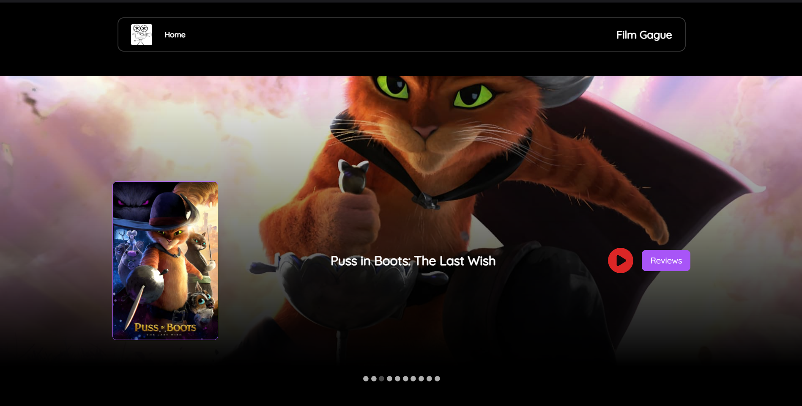
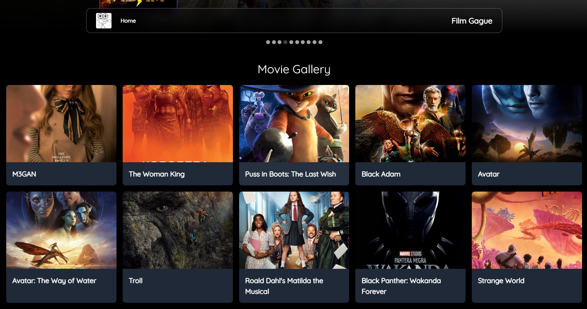
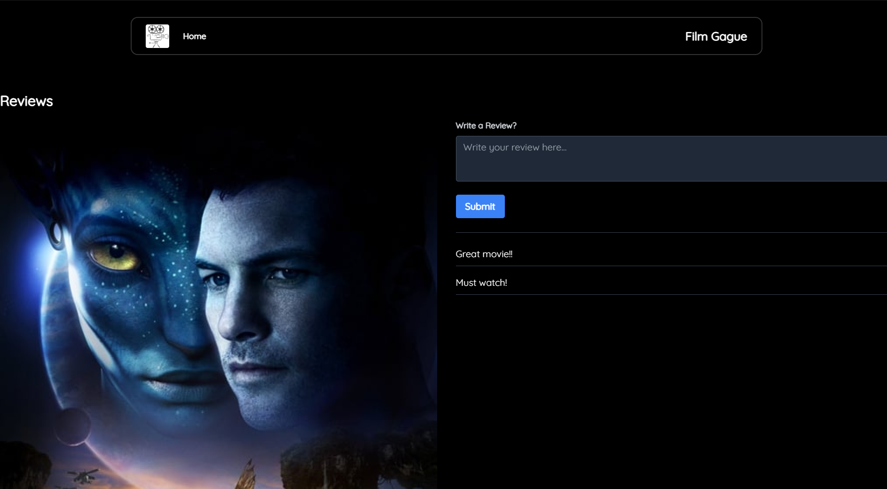
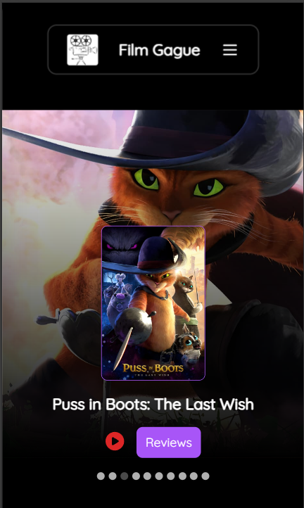
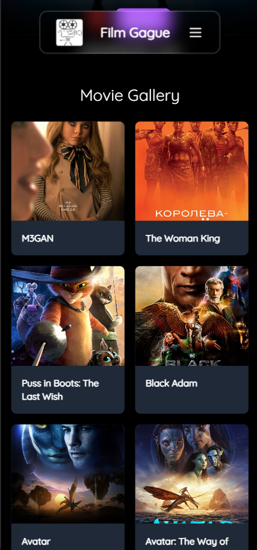

# FilmGague

FilmGague is a movie review platform that offers a comprehensive collection of films, allowing users to discover new movies, watch trailers, and share their thoughts through personalized reviews. Made using Srping Boot for the backend the APIs fetch movies from the MongoDB database and displays them. React along with Tailwind CSS is used for the frontend it is mobile responsive too.
## Run Locally


### for frontend

Clone the project

```bash
  git clone https://github.com/viraj-ap/FilmGague.git
```

Install dependencies

```bash
  npm install or npm i
```

Start the server

```bash
  npm run dev
```
### MongoDB database

Add database records

```
use the provided movies.json file to include records in you MongoDB database.

```

### for backend
Make an .env file

```for backend 
make sure you make a .env file and replace it with you own MongoDB cluster details.
```
then run the Spring Boot application.


## Screenshots








